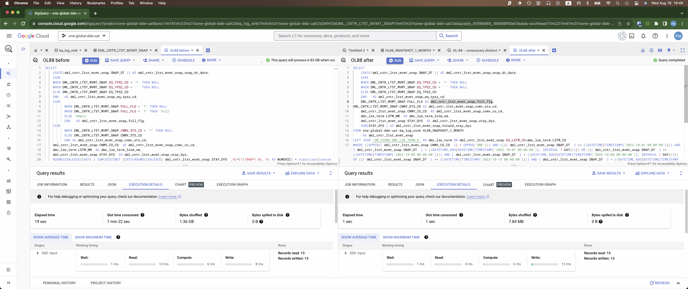

# Things that could be done
- Change snapshot table configurations:
  - Clustering fields update
  - Partition by date, not month
  - Update PK into this table instead of doing in LookML --> sum_distinct should be removed
  - Update CASE WHEN logic into this table directly

- Changes to other views:
  - Grouping related views into DWC_GEOLOCATION table
  - Materializing them as TABLE instead of VIEW

We will first just test with changes to snapshot table to see how performance can be improved.

# Change 1: altering the snapshot table alone

> OL88_snapshot_1_month.sql

## Unit test on 1 month partition

> the SQL used is just 1 example from Looker explore

## Unit test on 2-3 month partitions

Purpose: to check if the execution time and slot consumption is linear. If it's not we would need to clone the full table (1.7Bil records) to see the difference in performance realistically.

